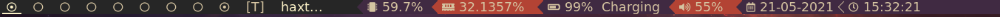
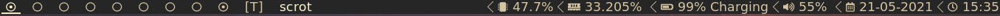

# PowerStatus-dwm
 A modular Powerline statusbar for dwm written in plain bash

# Requirements
* dwm (optionally with statuscolor patch)
* a patched powerline font (the machine tested on was using DeJa Vu fonts)
* FontAwesome for the icons   
All of these are available in the AUR

# Installation
If you have statuscolor patch for dwm, then:   
```bash
sudo chmod +x PowerStatusColor.sh
./PowerStatusColor.sh 
```
optionally you can make a symlink:   
```bash
sudo ln -sf PowerStatusColor.sh /usr/bin
```

# Note
To use the PowerBar-color statusbar , you will require the [statuscolor](https://dwm.suckless.org/patches/statusbar) patch   
You will aslo require atleast seven colors declared in your config.h. You can use my [colors.h](https://github.com/HashTag-4512/Suckless-Programs/blob/main/dwm/colors.h) file from my dwm build as a template


# Preview

PowerBar-Color   
   

PowerBar without color   
   

